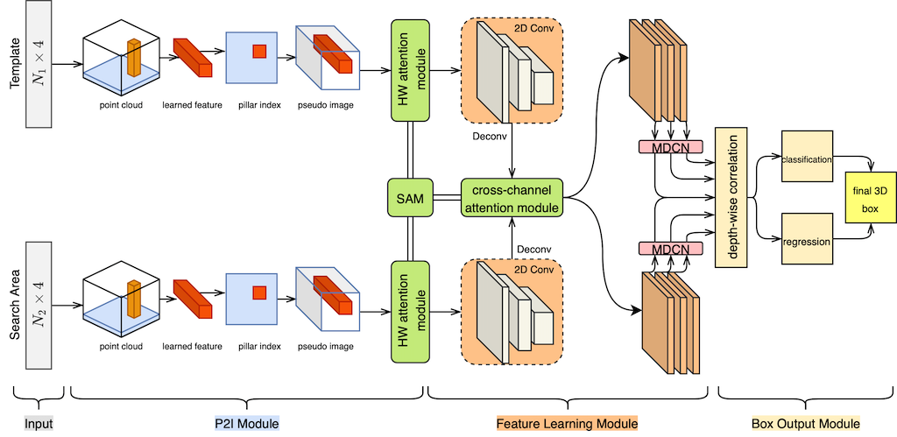
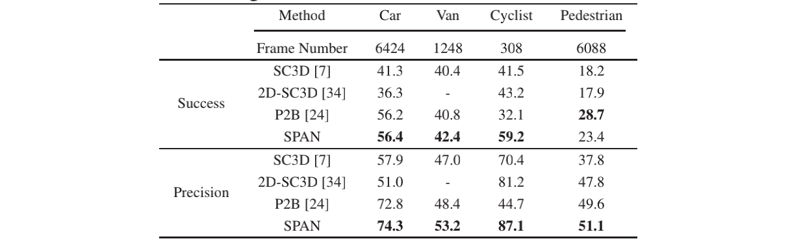
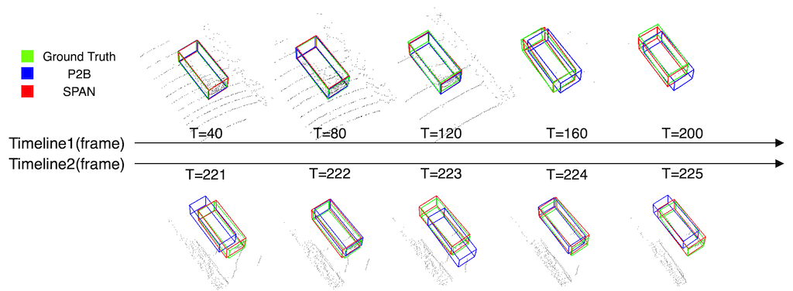

# SPAN: SiamPillars Attention Network for 3D Object Tracking in Point Clouds
This is an official repository for SPAN: SiamPillars Attention Network for 3D Object Tracking in Point Clouds.


## Introduction

We turn 3D object tracking into 2D object tracking in a one-stage network by firstly converting the point cloud data into 2D pseudo images for both the template and the search area. Using separate attention mechanism. A modulated deformable convolutional network is adopted after. SPAN runs with 22.4 FPS on a single NVIDIA 1650 GPU.

<p align="center">
  
</p>

## Preliminary

* Minimum Dependencies(Main):

python==3.7  
torch==1.1.0  
spconv==1.0(https://github.com/traveller59/spconv)  
DCN==1.0(https://github.com/chengdazhi/Deformable-Convolution-V2-PyTorch)  
mayavi==4.7.1  
opencv-python==4.3.0.36  
pyquarternion==0.9.5  
Shapely==1.7.0  

* Build box_overlap module in utils
```
    python setup.py
```

* Download the dataset from [KITTI Tracking](http://www.cvlibs.net/datasets/kitti/eval_tracking.php).

	Download [velodyne](http://www.cvlibs.net/download.php?file=data_tracking_velodyne.zip), [calib](http://www.cvlibs.net/download.php?file=data_tracking_calib.zip) and [label_02](http://www.cvlibs.net/download.php?file=data_tracking_label_2.zip) in the dataset and place them under the same parent folder.

## Training
You need to first change config.py for different cases.

Train a new SPAN model for one category
```
python train_tracking.py --data_dir=<kitti data path> --category_name=<category name>
```

Or, you can first change specific parameters and directly run
```
python train_tracking.py
```

## Testing
Test a new SPAN model, just do similarly as mentioned in Training process
```
python test_tracking.py --data_dir=<kitti data path> --category_name=<category name>
```

Please refer to the article for other settings.

## Results
Our results of different categories
<p align="center">
  
</p>

The comparison of continuous five frames of Car
<p align="center">
  
</p>

## Acknowledgements

Thank Giancola for his implementation of [SC3D](https://github.com/SilvioGiancola/ShapeCompletion3DTracking). 
Thank Qi for his implementation of [P2B](https://github.com/HaozheQi/P2B). 
Thank Shi for the point clouds tool box [OpenPCDet](https://github.com/open-mmlab/OpenPCDet). 
And thank traveller59[spconv] and chengdazhi[DCN]. 
